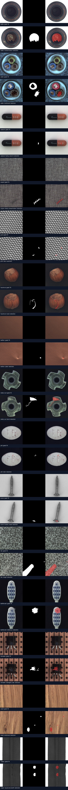

# Báo cáo kiểm tra dữ liệu — giai đoạn 1

Sinh lúc: 2026-09-10T05:24:55.496882+00:00. Môi trường: kaggle.

Đã kiểm tra 5354 ảnh thuộc 15 category.
Đây là bằng chứng kiểm tra dữ liệu được truyền vào lệnh; không phải kết quả huấn luyện.

## Thiết kế và lý do

Adapter giữ đường dẫn tương đối để chuyển dữ liệu giữa Kaggle/local mà không đổi sample ID.
Train normal được chia fit/validation/calibration; test gốc được chia selection/final_test.
Việc giữ final_test độc lập cho phép kiểm chứng lựa chọn mô hình ở giai đoạn sau.

## Fingerprint và tái lập

- Dataset: `061f3c21830a4d837464311b4dd06f2538174fd46dd7f1efd7ed431f3bcd73a1`
- Split: `c3e88882c2e2df4283373ecaa9c7f4cc3ec7eb99e9201cf493f3e1f0902e6ff9`
- Seed: `42`
- Source: `dbdba4a5c82ea6ae9c468a5125192924cbb0cc2d209ea7c6c99d01b0148b01f1`

Xem `resolved-config.json`, `inventory.json`, `split-manifest.json` và `data-report.json` cùng thư mục.

## Số mẫu sau chia tập

- bottle: fit=147, validation_normal=31, calibration_normal=31, selection=32, final_test=51
- cable: fit=158, validation_normal=33, calibration_normal=33, selection=57, final_test=93
- capsule: fit=155, validation_normal=32, calibration_normal=32, selection=51, final_test=81
- carpet: fit=196, validation_normal=42, calibration_normal=42, selection=43, final_test=74
- grid: fit=186, validation_normal=39, calibration_normal=39, selection=28, final_test=50
- hazelnut: fit=275, validation_normal=58, calibration_normal=58, selection=42, final_test=68
- leather: fit=173, validation_normal=36, calibration_normal=36, selection=46, final_test=78
- metal_nut: fit=154, validation_normal=33, calibration_normal=33, selection=44, final_test=71
- pill: fit=187, validation_normal=40, calibration_normal=40, selection=63, final_test=104
- screw: fit=224, validation_normal=48, calibration_normal=48, selection=62, final_test=98
- tile: fit=162, validation_normal=34, calibration_normal=34, selection=45, final_test=72
- toothbrush: fit=42, validation_normal=9, calibration_normal=9, selection=16, final_test=26
- transistor: fit=151, validation_normal=31, calibration_normal=31, selection=40, final_test=60
- wood: fit=173, validation_normal=37, calibration_normal=37, selection=30, final_test=49
- zipper: fit=168, validation_normal=36, calibration_normal=36, selection=56, final_test=95

## Kiểm chứng

Đã decode ảnh, kiểm tra mask nhị phân/cùng kích thước, ảnh trùng, fingerprint và vai trò split.
Đọc số lượng từng category trong `split-counts.csv`; không suy diễn rằng mọi loại lỗi có đủ mẫu.

## Cảnh báo và giới hạn

Không phát hiện cảnh báo chia tập.

Kiểm tra duplicate chỉ phát hiện ảnh trùng pixel; chưa phát hiện near-duplicate hoặc cùng vật thể vật lý.
Chưa huấn luyện, calibration threshold hay đo metric mô hình.

## Kiểm tra trực quan

Mỗi hàng: ảnh gốc — mask — overlay. Chỉ xem fit/selection.

## Tự kiểm tra

1. Vì sao đổi data root không đổi fingerprint? Vì hash dùng đường dẫn tương đối và nội dung.
2. Vì sao không xem final_test trong gallery? Để tránh chỉnh thiết kế dựa trên holdout.
3. Vì sao mask dùng nearest-neighbor? Để giữ nhãn rời rạc khi resize.

## Bước tiếp theo

Lưu output thành Kaggle Notebook Version, kiểm tra cảnh báo, rồi dùng manifest này cho evaluator và adapter mô hình.
